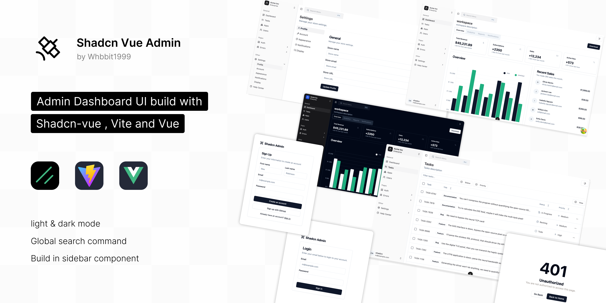

# Shadcn Vue Admin

[](https://github.com/antfu/eslint-config)

基于 Vue 3、Vite 和 Shadcn-vue 构建的现代化、功能丰富的管理后台。Fork 自 [shadcn-admin](https://github.com/satnaing/shadcn-admin)，具有增强的功能和改善的用户体验。




## ✨ 功能特性

### 🎨 用户界面
- **亮色/暗色模式** - 无缝主题切换，状态持久化
- **响应式设计** - 适配所有设备尺寸
- **现代化 UI 组件** - 基于 Shadcn-vue 和 Inspira UI 构建
- **自定义动画** - 流畅的过渡和微交互
- **无障碍优先** - 符合 WCAG 标准的组件
- **主题定制** - 8 种内置主题，支持自定义颜色和圆角

### 🚀 核心功能
- **全局搜索命令** - 键盘快捷键快速导航
- **智能侧边栏** - 可折叠导航，支持嵌套菜单
- **自动生成路由** - 基于文件的路由系统
- **国际化支持** - 多语言支持（中英文）
- **状态管理** - Pinia 持久化存储
- **AI 聊天界面** - 交互式 AI 对话系统

### 📊 仪表板与分析
- **仪表板概览** - 实时指标和图表
- **数据表格** - 可排序、可筛选、分页表格
- **用户管理** - 完整的 CRUD 操作
- **任务管理** - 待办事项系统，状态跟踪
- **计费系统** - 计划管理和支付历史
- **应用管理** - 应用程序列表和管理

### 🔐 认证与安全
- **多步骤认证** - 登录、注册、OTP 验证
- **密码恢复** - 忘记密码流程
- **路由守卫** - 受保护的路由和认证
- **会话管理** - 持久化登录状态
- **模拟认证** - 开发用演示登录系统

### 🛠️ 开发体验
- **TypeScript** - 完整的类型安全
- **ESLint** - 代码质量和一致性
- **自动导入** - 自动组件和 API 导入
- **热重载** - Vite 快速开发
- **构建优化** - 树摇和代码分割
- **环境验证** - 基于 Zod 的环境变量验证

## 🛠️ 技术栈

### 前端框架
- **[Vue 3](https://vuejs.org/)** - 渐进式 JavaScript 框架
- **[Vite](https://vitejs.dev/)** - 下一代构建工具
- **[TypeScript](https://www.typescriptlang.org/)** - 类型安全的 JavaScript

### UI 库
- **[Shadcn-vue](https://www.shadcn-vue.com/)** - 精美的 UI 组件
- **[Inspira UI](https://inspira-ui.com/)** - 高级 UI 效果和动画
- **[Tailwind CSS](https://tailwindcss.com/)** - 实用优先的 CSS 框架

### 状态管理
- **[Pinia](https://pinia.vuejs.org/)** - 直观的 Vue 状态管理
- **[Persisted State](https://prazdevs.github.io/pinia-plugin-persistedstate/)** - 持久化存储

### 开发工具
- **[Auto Import](https://github.com/antfu/unplugin-auto-import)** - 自动导入
- **[Vue Components](https://github.com/antfu/unplugin-vue-components)** - 自动导入组件
- **[Vue Router](https://github.com/posva/unplugin-vue-router)** - 基于文件的路由
- **[Vue Layouts](https://github.com/JohnCampionJr/vite-plugin-vue-layouts)** - 布局系统

### 数据与图表
- **[TanStack Vue Query](https://tanstack.com/query/latest)** - 数据获取和缓存
- **[TanStack Table](https://tanstack.com/table/latest)** - 强大的数据表格
- **[Vue ECharts](https://github.com/ecomfe/vue-echarts)** - 基于 Apache ECharts 的图表组件

### 图标与样式
- **[Lucide Icons](https://lucide.dev/)** - 精美的图标库
- **[Iconify](https://iconify.design/)** - 图标框架
- **[Tailwind Animate](https://github.com/jamiebuilds/tailwindcss-animate)** - 动画工具

### 验证与表单
- **[Vee-Validate](https://vee-validate.logaretm.com/)** - 表单验证
- **[Zod](https://zod.dev/)** - TypeScript 优先的架构验证

## 📁 项目结构

```
src/
├── components/          # 可复用的 UI 组件
│   ├── ui/             # Shadcn-vue 组件
│   ├── app-sidebar/    # 导航侧边栏
│   ├── data-table/     # 表格组件
│   ├── marketing/      # 营销页面组件
│   ├── inspira-ui/     # 高级 UI 效果
│   └── command-menu-panel/ # 全局搜索组件
├── pages/              # 应用页面
│   ├── dashboard/      # 仪表板概览
│   ├── users/          # 用户管理
│   ├── tasks/          # 任务管理
│   ├── billing/        # 计费和计划
│   ├── settings/       # 用户设置
│   ├── auth/           # 认证页面
│   ├── ai-talk/        # AI 对话界面
│   ├── apps/           # 应用程序管理
│   ├── errors/         # 错误页面
│   └── marketing/      # 营销落地页
├── composables/        # Vue 组合式函数
├── stores/             # Pinia 存储
├── plugins/            # Vue 插件
├── router/             # 路由配置
├── types/              # TypeScript 类型
└── utils/              # 工具函数
```

## 🚀 快速开始

### 环境要求
- Node.js 18+ 
- pnpm（推荐）或 npm

### 安装步骤

1. **克隆仓库**
```bash
git clone https://github.com/yourusername/shadcn-vue-admin.git
cd shadcn-vue-admin
```

2. **安装依赖**
```bash
pnpm install
```

3. **设置环境变量**
```bash
# 复制环境变量示例文件
cp .env.example .env

# 编辑环境变量
VITE_SERVER_API_URL=https://api.example.com
VITE_SERVER_API_PREFIX=/api/v1
VITE_SERVER_API_TIMEOUT=5000
```

4. **启动开发服务器**
```bash
pnpm dev
```

5. **打开浏览器**
访问 `http://localhost:5173`

### 生产构建

```bash
# 构建项目
pnpm build

# 预览构建结果
pnpm preview
```

## 📖 可用脚本

```bash
pnpm dev          # 启动开发服务器
pnpm build        # 生产构建
pnpm preview      # 预览生产构建
pnpm lint         # 运行 ESLint
pnpm lint:fix     # 修复 ESLint 错误
pnpm release      # 生成更新日志和发布
```

## 🎨 自定义

### 主题定制
您可以使用 [Tweakcn](https://tweakcn.com/editor/theme) 来定制主题。将 CSS 变量复制到 `src/assets/index.css` 并修改 `:root`、`:dark` 和 `@theme inline` 部分。

**可用主题：**
- Zinc（默认）
- Red、Rose、Orange
- Green、Blue、Yellow
- Violet

### 添加新页面
1. 在 `src/pages/` 中创建新的 `.vue` 文件
2. 文件将自动转换为路由
3. 使用 `<route>` 块来配置路由元数据

### 组件开发
- 将可复用组件放在 `src/components/`
- 使用 `ui/` 目录存放 Shadcn-vue 组件
- 遵循现有的组件模式

### 环境变量
项目使用 Zod 进行环境变量验证。在 `src/utils/env.ts` 中添加新变量：

```typescript
const EnvSchema = z.object({
  VITE_SERVER_API_URL: z.string().url(),
  VITE_SERVER_API_PREFIX: z.string(),
  VITE_SERVER_API_TIMEOUT: z.coerce.number().default(5000),
  // 在此添加您的新变量
})
```

## 🐳 部署

### Docker 部署
```bash
# 使用 Docker 构建和运行
docker-compose up -d

# 或手动构建镜像
docker build -t shadcn-vue-admin .
docker run -p 3000:80 shadcn-vue-admin
```

### Vercel 部署
项目包含 `vercel.json` 文件，可轻松部署到 Vercel。

### Nginx 配置
使用提供的 `deploy/nginx.conf` 进行生产环境部署。

## 🔧 开发

### 代码质量
- **ESLint**: 使用 Antfu 配置进行代码检查
- **TypeScript**: 完整的类型安全
- **Pre-commit hooks**: 自动代码格式化

### 项目结构
- **基于文件的路由**: 自动路由生成
- **自动导入**: 无需手动导入组件
- **布局系统**: 灵活的页面布局
- **组合式函数**: 可复用的 Vue 组合式函数

## 🤝 贡献指南

1. Fork 本仓库
2. 创建功能分支 (`git checkout -b feature/amazing-feature`)
3. 提交更改 (`git commit -m 'Add amazing feature'`)
4. 推送到分支 (`git push origin feature/amazing-feature`)
5. 开启 Pull Request

### 开发指南
- 遵循现有的代码风格
- 为新功能添加 TypeScript 类型
- 更新新功能的文档
- 彻底测试您的更改

## 📝 许可证

本项目采用 MIT 许可证 - 查看 [LICENSE](LICENSE) 文件了解详情。

## 🙏 致谢

- **原始设计**: [shadcn-admin](https://github.com/satnaing/shadcn-admin) by Sat Naing
- **UI 组件**: [Shadcn-vue](https://www.shadcn-vue.com/) 团队
- **图标**: [Lucide](https://lucide.dev/) 和 [Iconify](https://iconify.design/)
- **构建工具**: [Vite](https://vitejs.dev/) 和 [Vue](https://vuejs.org/) 团队

## 📞 支持

如果您有任何问题或需要帮助，请在 GitHub 上开启 issue 或联系维护者。

---

**感谢 [Whbbit](https://github.com/Whbbit1999) 用 ❤️ 制作**
