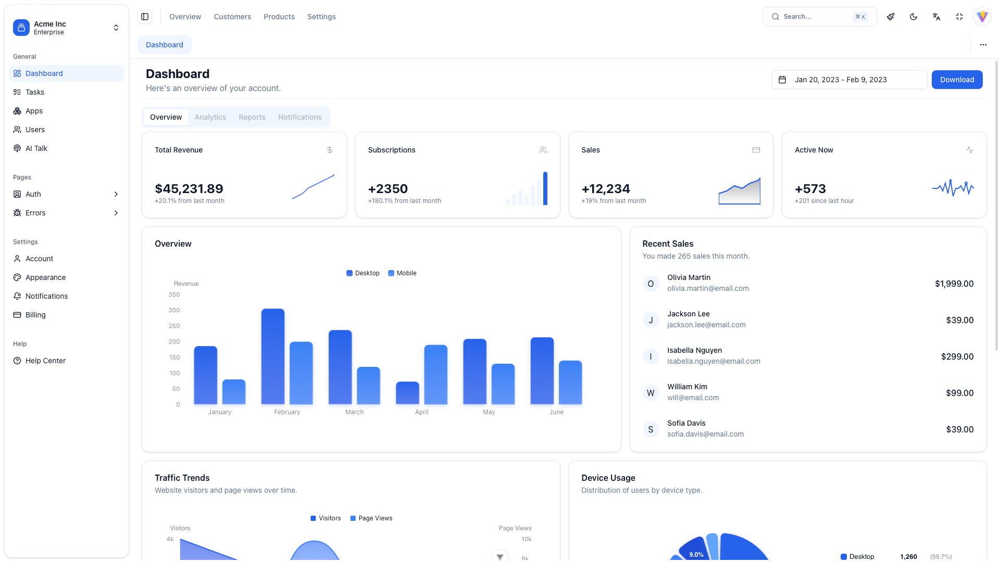

# Snail Vue App

[](https://github.com/antfu/eslint-config)

[中文](./README-CN.md)

A modern, feature-rich admin dashboard built with Vue 3, Vite, and Shadcn-vue. Forked from [shadcn-admin](https://github.com/satnaing/shadcn-admin) with enhanced functionality and improved user experience.




## ✨ Features

### 🎨 UI/UX
- **Light/Dark Mode** - Seamless theme switching with persistent state
- **Responsive Design** - Optimized for all device sizes
- **Modern UI Components** - Built with Shadcn-vue and Inspira UI
- **Custom Animations** - Smooth transitions and micro-interactions
- **Accessibility First** - WCAG compliant components
- **Theme Customization** - 8 built-in themes with customizable colors and radius

### 🚀 Core Functionality
- **Global Search Command** - Quick navigation with keyboard shortcuts
- **Smart Sidebar** - Collapsible navigation with nested menus
- **Auto-generated Routes** - File-based routing with layouts
- **Internationalization** - Multi-language support (English/Chinese)
- **State Management** - Pinia with persistent storage
- **AI Chat Interface** - Interactive AI conversation system

### 📊 Dashboard & Analytics
- **Dashboard Overview** - Real-time metrics and charts
- **Data Tables** - Sortable, filterable, and paginated tables
- **User Management** - Complete CRUD operations
- **Task Management** - Todo system with status tracking
- **Billing System** - Plan management and payment history
- **Apps Management** - Application listing and management

### 🔐 Authentication & Security
- **Multi-step Auth** - Sign in, sign up, OTP verification
- **Password Recovery** - Forgot password flow
- **Route Guards** - Protected routes and authentication
- **Session Management** - Persistent login state
- **Mock Authentication** - Demo login system for development

### 🛠️ Developer Experience
- **TypeScript** - Full type safety
- **ESLint** - Code quality and consistency
- **Auto-imports** - Automatic component and API imports
- **Hot Reload** - Fast development with Vite
- **Build Optimization** - Tree-shaking and code splitting
- **Environment Validation** - Zod-based environment variable validation

## 🛠️ Tech Stack

### Frontend Framework
- **[Vue 3](https://vuejs.org/)** - Progressive JavaScript framework
- **[Vite](https://vitejs.dev/)** - Next-generation build tool
- **[TypeScript](https://www.typescriptlang.org/)** - Type-safe JavaScript

### UI Libraries
- **[Shadcn-vue](https://www.shadcn-vue.com/)** - Beautiful UI components
- **[Inspira UI](https://inspira-ui.com/)** - Advanced UI effects and animations
- **[Tailwind CSS](https://tailwindcss.com/)** - Utility-first CSS framework

### State Management
- **[Pinia](https://pinia.vuejs.org/)** - Intuitive Vue state management
- **[Persisted State](https://prazdevs.github.io/pinia-plugin-persistedstate/)** - Persistent storage

### Development Tools
- **[Auto Import](https://github.com/antfu/unplugin-auto-import)** - Automatic imports
- **[Vue Components](https://github.com/antfu/unplugin-vue-components)** - Auto-import components
- **[Vue Router](https://github.com/posva/unplugin-vue-router)** - File-based routing
- **[Vue Layouts](https://github.com/JohnCampionJr/vite-plugin-vue-layouts)** - Layout system

### Data & Charts
- **[TanStack Vue Query](https://tanstack.com/query/latest)** - Data fetching and caching
- **[TanStack Table](https://tanstack.com/table/latest)** - Powerful data tables
- **[Vue ECharts](https://github.com/ecomfe/vue-echarts)** - Chart components based on Apache ECharts

### Icons & Styling
- **[Lucide Icons](https://lucide.dev/)** - Beautiful icon library
- **[Iconify](https://iconify.design/)** - Icon framework
- **[Tailwind Animate](https://github.com/jamiebuilds/tailwindcss-animate)** - Animation utilities

### Validation & Forms
- **[Vee-Validate](https://vee-validate.logaretm.com/)** - Form validation
- **[Zod](https://zod.dev/)** - TypeScript-first schema validation

## 📁 Project Structure

```
src/
├── components/          # Reusable UI components
│   ├── ui/             # Shadcn-vue components
│   ├── app-sidebar/    # Navigation sidebar
│   ├── data-table/     # Table components
│   ├── marketing/      # Marketing page components
│   ├── inspira-ui/     # Advanced UI effects
│   └── command-menu-panel/ # Global search components
├── pages/              # Application pages
│   ├── dashboard/      # Dashboard overview
│   ├── users/          # User management
│   ├── tasks/          # Task management
│   ├── billing/        # Billing and plans
│   ├── settings/       # User settings
│   ├── auth/           # Authentication pages
│   ├── ai-talk/        # AI conversation interface
│   ├── apps/           # Applications management
│   ├── errors/         # Error pages
│   └── marketing/      # Marketing landing page
├── composables/        # Vue composables
├── stores/             # Pinia stores
├── plugins/            # Vue plugins
├── router/             # Route configuration
├── types/              # TypeScript types
└── utils/              # Utility functions
```

## 🚀 Quick Start

### Prerequisites
- Node.js 18+ 
- pnpm (recommended) or npm

### Installation

1. **Clone the repository**
```bash
git clone https://github.com/yourusername/shadcn-vue-admin.git
cd shadcn-vue-admin
```

2. **Install dependencies**
```bash
pnpm install
```

3. **Set up environment variables**
```bash
# Copy the example environment file
cp .env.example .env

# Edit the environment variables
VITE_SERVER_API_URL=https://api.example.com
VITE_SERVER_API_PREFIX=/api/v1
VITE_SERVER_API_TIMEOUT=5000
```

4. **Start development server**
```bash
pnpm dev
```

5. **Open your browser**
Navigate to `http://localhost:5173`

### Build for Production

```bash
# Build the project
pnpm build

# Preview the build
pnpm preview
```

## 📖 Available Scripts

```bash
pnpm dev          # Start development server
pnpm build        # Build for production
pnpm preview      # Preview production build
pnpm lint         # Run ESLint
pnpm lint:fix     # Fix ESLint errors
pnpm release      # Generate changelog and release
```

## 🎨 Customization

### Theme Customization
You can customize the theme using [Tweakcn](https://tweakcn.com/editor/theme). Copy the CSS variables to `src/assets/index.css` and modify the `:root`, `:dark`, and `@theme inline` sections.

**Available Themes:**
- Zinc (default)
- Red, Rose, Orange
- Green, Blue, Yellow
- Violet

### Adding New Pages
1. Create a new `.vue` file in `src/pages/`
2. The file will be automatically converted to a route
3. Use `<route>` blocks to configure route metadata

### Component Development
- Place reusable components in `src/components/`
- Use the `ui/` directory for Shadcn-vue components
- Follow the existing component patterns

### Environment Variables
The project uses Zod for environment variable validation. Add new variables to `src/utils/env.ts`:

```typescript
const EnvSchema = z.object({
  VITE_SERVER_API_URL: z.string().url(),
  VITE_SERVER_API_PREFIX: z.string(),
  VITE_SERVER_API_TIMEOUT: z.coerce.number().default(5000),
  // Add your new variables here
})
```

## 🐳 Deployment

### Docker Deployment
```bash
# Build and run with Docker
docker-compose up -d

# Or build the image manually
docker build -t shadcn-vue-admin .
docker run -p 3000:80 shadcn-vue-admin
```

### Vercel Deployment
The project includes `vercel.json` for easy deployment to Vercel.

### Nginx Configuration
Use the provided `deploy/nginx.conf` for production deployment.

## 🔧 Development

### Code Quality
- **ESLint**: Code linting with Antfu's config
- **TypeScript**: Full type safety
- **Pre-commit hooks**: Automatic code formatting

### Project Structure
- **File-based routing**: Automatic route generation
- **Auto-imports**: No need to manually import components
- **Layout system**: Flexible page layouts
- **Composables**: Reusable Vue composition functions

## 🤝 Contributing

1. Fork the repository
2. Create a feature branch (`git checkout -b feature/amazing-feature`)
3. Commit your changes (`git commit -m 'Add amazing feature'`)
4. Push to the branch (`git push origin feature/amazing-feature`)
5. Open a Pull Request

### Development Guidelines
- Follow the existing code style
- Add TypeScript types for new features
- Update documentation for new functionality
- Test your changes thoroughly

## 📝 License

This project is licensed under the MIT License - see the [LICENSE](LICENSE) file for details.

## 🙏 Acknowledgments

- **Original Design**: [shadcn-admin](https://github.com/satnaing/shadcn-admin) by Sat Naing
- **UI Components**: [Shadcn-vue](https://www.shadcn-vue.com/) team
- **Icons**: [Lucide](https://lucide.dev/) and [Iconify](https://iconify.design/)
- **Build Tools**: [Vite](https://vitejs.dev/) and [Vue](https://vuejs.org/) teams

## 📞 Support

If you have any questions or need help, please open an issue on GitHub or contact the maintainers.

---

**Thank you to [Whbbit](https://github.com/Whbbit1999) for ❤️ making**
